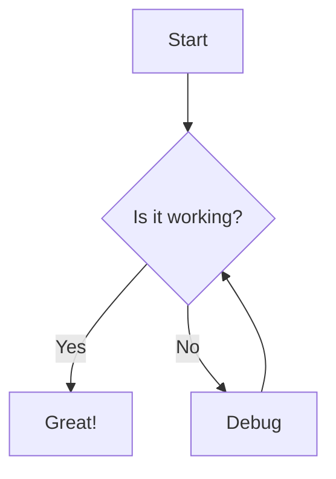
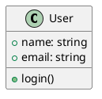

# Markdown Guide for Technical Blogging

This guide will show you how to write effective technical blog posts using Markdown.

## Table of Contents

1. [Basic Markdown Syntax](#basic-markdown-syntax)
2. [Code Blocks and Syntax Highlighting](#code-blocks)
3. [Technical Documentation Features](#technical-documentation)
4. [Diagrams and Charts](#diagrams)
5. [Best Practices](#best-practices)

## Basic Markdown Syntax {#basic-markdown-syntax}

### Headers

```markdown
# H1 - Main Title
## H2 - Section
### H3 - Subsection
#### H4 - Sub-subsection
```

### Text Formatting

```markdown
**Bold text**
*Italic text*
~~Strikethrough~~
`inline code`
```

### Lists

Ordered lists:
```markdown
1. First item
2. Second item
   1. Sub-item
   2. Sub-item
```

Unordered lists:
```markdown
- Item
- Another item
  - Sub-item
  - Sub-item
```

### Links and Images

```markdown
[Link text](URL)


<!-- Reference style -->
[link-id]: URL
[Link text][link-id]
```

## Code Blocks {#code-blocks}

### Syntax Highlighting

````markdown
```python
def hello_world():
    print("Hello, World!")
```

```javascript
function greet(name) {
    console.log(`Hello, ${name}!`);
}
```

```sql
SELECT * FROM users WHERE active = true;
```
````

### Code Block with Line Numbers

```markdown

def factorial(n):
    if n == 0:
        return 1
    return n * factorial(n-1)

```

### Code with Output

````markdown
```bash
$ python hello.py
Hello, World!
```
````

## Technical Documentation {#technical-documentation}

### Tables

```markdown
| Parameter | Type | Description |
|-----------|------|-------------|
| name | string | User's name |
| age | integer | User's age |
| email | string | User's email |
```

### Blockquotes

```markdown
> **Note:** Important information here
> 
> Multiple lines can be used
```

### Definition Lists

```markdown
Term
: Definition here
: Another definition

Another term
: Its definition
```

### Task Lists

```markdown
- [x] Completed task
- [ ] Pending task
- [ ] Future task
```

## Diagrams {#diagrams}

### Mermaid Diagrams

````markdown

````

### PlantUML (if supported)

````markdown

````

## Best Practices {#best-practices}

### 1. Document Structure

```markdown
---
layout: post
title: "Your Technical Post"
date: 2024-04-05
categories: [programming, tutorial]
tags: [python, web-dev]
---

# Main Title

Brief introduction (1-2 paragraphs)

## Table of Contents

## First Section

### Subsection

## Conclusion
```

### 2. Code Examples

- Always specify the language for syntax highlighting
- Include comments in code blocks
- Show both code and output when relevant

```python
# This is a simple example
def greet(name):
    """
    Greets the user with their name
    """
    return f"Hello, {name}!"
```

### 3. Technical Writing Tips

1. **Use Clear Headers**
   - Make sections easily scannable
   - Keep hierarchy logical

2. **Code Formatting**
   - Use `inline code` for:
     - Variable names
     - File names
     - Short commands

3. **Visual Elements**
   - Add diagrams for complex concepts
   - Include screenshots when needed
   - Use tables for structured data

### 4. Common Patterns

#### API Documentation

```markdown
## API Endpoint

`GET /api/v1/users`

### Parameters

| Name | Type | Required | Description |
|------|------|----------|-------------|
| page | int | No | Page number |

### Response

```json
{
    "users": [],
    "total": 0
}
```
```

#### Tutorial Steps

```markdown
## Step 1: Installation

1. First, install the package:
   ```bash
   npm install package-name
   ```

2. Configure your settings:
   ```js
   const config = {
     // settings here
   };
   ```

## Step 2: Usage
```

### 5. SEO Optimization

- Use descriptive titles
- Include relevant tags
- Structure content with proper headings
- Add meta descriptions in front matter

```yaml
---
layout: post
title: "Complete Guide to Python Virtual Environments"
description: "Learn how to create, activate, and manage Python virtual environments for better dependency management"
tags: [python, virtualenv, programming]
---
```

## Advanced Features

### Mathematical Equations

Using LaTeX syntax (if supported by your Jekyll setup):

```markdown
Inline equation: $E = mc^2$

Block equation:
$$
\frac{n!}{k!(n-k)!} = \binom{n}{k}
$$
```

### Footnotes

```markdown
Here's a sentence with a footnote[^1].

[^1]: This is the footnote content.
```

### Abbreviations

```markdown
*[HTML]: Hyper Text Markup Language
*[CSS]: Cascading Style Sheets

Use HTML and CSS in your document.
```

## Resources

- [GitHub Flavored Markdown](https://github.github.com/gfm/)
- [Jekyll Markdown Options](https://jekyllrb.com/docs/configuration/markdown/)
- [Markdown Guide](https://www.markdownguide.org/)

## Conclusion

This guide covers the essential Markdown features for technical blogging. Remember to:
- Structure your content logically
- Use appropriate formatting for code and technical content
- Include visual aids when helpful
- Follow consistent formatting patterns

Keep practicing and refer back to this guide as needed!